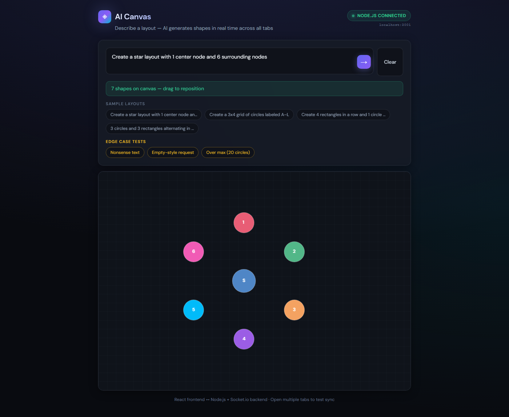
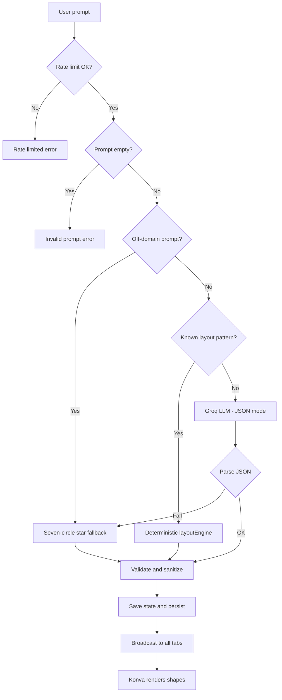
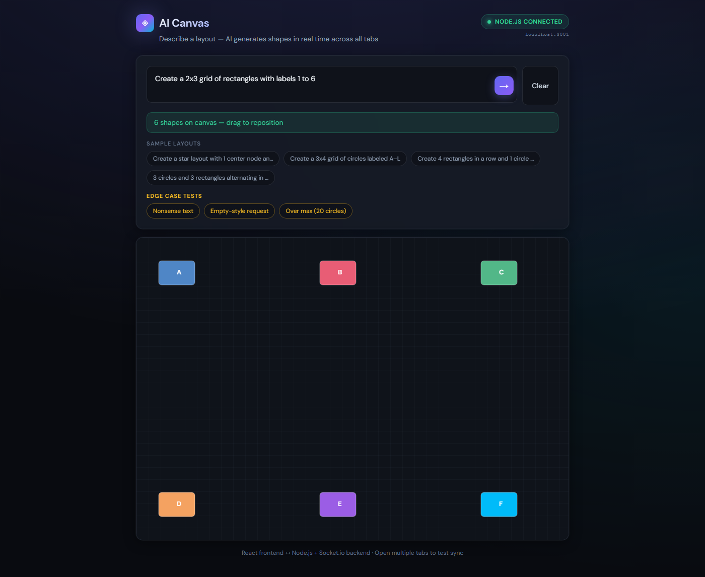
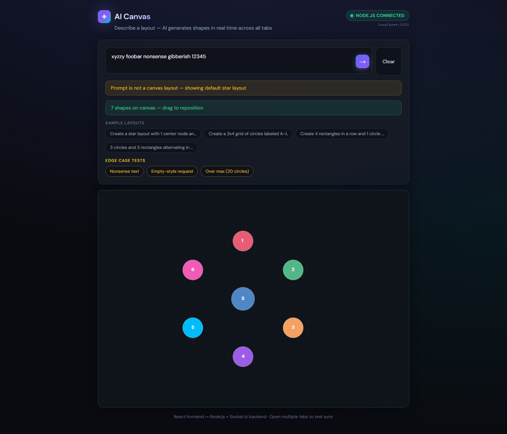

# AI Real-Time Canvas

A real-time collaborative canvas: describe a layout in natural language, the backend
produces structured JSON (shapes and coordinates), and the frontend renders draggable
circles and rectangles with React Konva. Multiple browser tabs stay in sync over Socket.io.



**Repository:** https://github.com/sarim-01/AI-Canvas-App

---

## Table of contents

1. [Overview](#1-overview)
2. [How reviewers evaluate this submission](#2-how-reviewers-evaluate-this-submission)
3. [Submission deliverables](#3-submission-deliverables)
4. [Tech stack](#4-tech-stack)
5. [Architecture](#5-architecture)
6. [How Generate works (flowchart)](#6-how-generate-works-flowchart)
7. [Getting started](#7-getting-started)
8. [Usage](#8-usage)
9. [API reference](#9-api-reference)
10. [AI output format](#10-ai-output-format)
11. [Server constraints](#11-server-constraints)
12. [Edge cases and fallback](#12-edge-cases-and-fallback)
13. [Persistence (bonus)](#13-persistence-bonus)
14. [Demo screenshots](#14-demo-screenshots)
15. [Testing](#15-testing)
16. [Project structure](#16-project-structure)
17. [What is on GitHub vs gitignored](#17-what-is-on-github-vs-gitignored)
18. [Security](#18-security)

---

## 1. Overview

| Component | Status | Notes |
|-----------|--------|--------|
| Backend (Express + Socket.io + Groq) | Done | Modular monolith, server is source of truth |
| Frontend (React + Konva + Zustand) | Done | Draggable shapes, live sync |
| Deterministic layout engine | Done | Star, grid, row, alternating patterns |
| Off-domain / invalid prompt guardrails | Done | Regex + rules → 7-circle star fallback |
| Server validation | Done | Max 12 nodes, bounds, label length |
| File persistence (server restart) | Done | `backend/data/canvas.json` (gitignored) |
| Automated tests | Done | `npm run test:layout`, `npm run test:all` |
| Demo screenshots | Done | [`screenshots/`](./screenshots/) + [`screenshots/README.md`](./screenshots/README.md) |
| Sample JSON | Done | [`backend/examples/`](./backend/examples/) |

**Commit history (two pushes):**

| When | Commit message |
|------|----------------|
| Start | `chore: initial scaffold for AI real-time canvas app` |
| Completion | `feat: complete AI real-time canvas application` |

---

## 2. How reviewers evaluate this submission

Reviewers typically **clone the repo**, add **their own** Groq API key, run backend + frontend, and try prompts themselves. They do **not** need your local `.env`, `node_modules`, or runtime `backend/data/canvas.json`.

| Criteria | How to verify in this project |
|----------|-------------------------------|
| **Accuracy & quality** | Run the app; use sample chips; check shapes, labels, sync |
| **Requirements fit** | Circles/rectangles only, max 12 nodes, JSON → canvas, Socket.io |
| **Technical approach** | Read flowchart below; inspect `promptToJson.ts`, `layoutEngine.ts`, `validator.ts` |
| **Presentation** | This README + [`screenshots/`](./screenshots/) + [`backend/examples/`](./backend/examples/) |

**Quick reviewer walkthrough (~10 minutes):**

1. Follow [Getting started](#7-getting-started).
2. Open two browser tabs → generate in one → confirm the other updates.
3. Drag a shape → confirm position sync.
4. Try **Quick layout** chips (star, grid).
5. Try an edge prompt (e.g. nonsense or “draw a laptop”) → 7-circle star + info banner.
6. Open **Logs** → confirm `route=deterministic`, `llm`, or `fallback`.
7. Optional: restart backend → layout reloads from disk ([Persistence](#13-persistence-bonus)).

---

## 3. Submission deliverables

| Deliverable | Where |
|-------------|--------|
| GitHub repository | This repo |
| How to run | [Getting started](#7-getting-started) |
| Two meaningful commits | See table in [Overview](#1-overview) |
| AI tools used | Below |
| What you would improve | Below |

### AI tools used

- **Cursor** — development assistance (scaffolding, implementation, documentation).
- **Groq API** — layout generation (`llama-3.3-70b-versatile`, `response_format: json_object`, temperature `0.3`).

### What I would improve

- A dedicated intent classifier for off-domain prompts (instead of regex-only rules).
- Collision-aware layout so shapes do not overlap.
- Multi-room canvases (separate boards per session).
- Redis-backed shared state for horizontal scaling.
- Undo/redo for canvas edits.

---

## 4. Tech stack

### Summary

| Layer | Technologies |
|-------|----------------|
| Frontend | React 18, TypeScript, Vite, React Konva, Zustand, socket.io-client |
| Backend | Node.js, Express, Socket.io, TypeScript |
| AI | Groq (`llama-3.3-70b-versatile`), JSON mode, temperature `0.3` |
| Architecture | Modular monolith (single API + SPA, not microservices) |

### Frontend (what & where)

| Technology | Role in this app | Location |
|------------|------------------|----------|
| React 18 | UI components | `frontend/src/components/` |
| TypeScript | Type safety | `frontend/src/` |
| Vite | Dev server & build | `frontend/vite.config.ts` |
| React Konva | Canvas rendering (circles, rectangles) | `Canvas.tsx`, `ShapeNode.tsx` |
| Zustand | Client canvas state | `store/useCanvasStore.ts` |
| socket.io-client | Real-time events | `hooks/useSocket.ts` |

### Backend (what & where)

| Technology | Role in this app | Location |
|------------|------------------|----------|
| Express | HTTP (`/health`, `/state`) | `backend/src/index.ts` |
| Socket.io | Generate, move, clear, broadcast | `socket/canvasHandlers.ts` |
| Groq SDK | LLM JSON layouts | `ai/promptToJson.ts` |
| Custom layout engine | Deterministic star/grid/row | `utils/layoutEngine.ts` |
| Validator | Max nodes, bounds, labels | `utils/validator.ts` |
| File store | Persist canvas on disk | `persist/fileStore.ts` |

### Tests

| Command | What it runs |
|---------|----------------|
| `npm run test:layout` | Backend unit tests for layout + off-domain rules |
| `npm run test:all` | Playwright: generate, drag, two-tab sync (servers must be running) |

---

## 5. Architecture

**Pattern:** modular monolith — one Node process owns canvas state; the React app is a thin client.

```
Client (React + Konva)
    ↔  Socket.io  ↔  Node.js (Express)
                         ├─ Prompt routing (off-domain / deterministic / LLM)
                         ├─ Validation & sanitization
                         ├─ In-memory canvas state
                         └─ Optional file persistence
```

**Design choices:**

- **Server as source of truth** — clients never apply unvalidated AI output.
- **Layered prompt handling** — cheap rules first, LLM only when needed.
- **Broadcast after validate** — all tabs receive the same `canvas:generated` payload.

**Key modules:** `backend/src/ai/promptToJson.ts`, `utils/layoutEngine.ts`, `utils/validator.ts`, `socket/canvasHandlers.ts`, `frontend/src/components/`.

---

## 6. How Generate works (flowchart)

When the user clicks **Generate**, raw LLM text is never sent to the browser unvalidated.



**ASCII summary:**

```
prompt → rate limit → off-domain? → fallback star
                    → known pattern? → layoutEngine (math)
                    → else → Groq JSON → parse → validate → save → broadcast → render
```

---

## 7. Getting started

### Prerequisites

- Node.js 18+
- Groq API key in `backend/.env` (`AI_API_KEY`; see `backend/.env.example`)

### Install and run

```bash
git clone https://github.com/sarim-01/AI-Canvas-App.git
cd AI-Canvas-App
cd backend && npm install
cd ../frontend && npm install
```

Copy `backend/.env.example` to `backend/.env` and set your API key.

**Terminal 1 — backend**

```bash
cd backend
npm run dev
```

**Terminal 2 — frontend**

```bash
cd frontend
npm run dev
```

Open http://localhost:5173. The header should show **Node.js connected**.

On Windows PowerShell, run `cd` and `npm run dev` on separate lines (or use `;` instead of `&&`).

---

## 8. Usage

1. Enter a prompt or use a **Quick layout** chip (★ Star, ▦ Grid, etc.).
2. **Generate** (or press Enter).
3. Drag shapes; other tabs update in real time.
4. **Logs** — live activity (`route=deterministic|llm|fallback`).
5. **View JSON** / **Export JSON** — inspect or download the layout.
6. **Clear** — reset the canvas for all connected clients.

**Real-time sync test:** open two tabs on the same URL; generate in one tab and drag a shape — the other tab should mirror changes.

**Sample prompts**

- `Create a star layout with 1 center node and 6 surrounding nodes`
- `Create a 3x4 grid of circles labeled A–L`
- `Create 4 rectangles in a row and 1 circle above center`

---

## 9. API reference

### REST

| Method | Path | Description |
|--------|------|-------------|
| `GET` | `/health` | Health check |
| `GET` | `/state` | Current canvas `{ nodes, updatedAt }` |

### Socket.io

| Event | Direction | Description |
|-------|-----------|-------------|
| `canvas:request` | Client → Server | Request state on connect |
| `canvas:state` | Server → Client | Full canvas snapshot |
| `canvas:generate` | Client → Server | `{ prompt }` |
| `canvas:generated` | Server → All | New layout or error |
| `canvas:clear` | Client → Server | Clear for all clients |
| `node:move` | Client → Server | Position after drag |
| `node:moved` | Server → Others | Position sync |
| `activity:log` | Server → All | Activity log line |

**Error codes:** `INVALID_PROMPT`, `AI_FAILED`, `VALIDATION_FAILED`, `RATE_LIMITED`.

---

## 10. AI output format

Example shape (full samples in [`backend/examples/`](./backend/examples/)):

```json
{
  "nodes": [
    {
      "type": "circle",
      "x": 400,
      "y": 300,
      "radius": 28,
      "label": "A",
      "color": "#4F86C6"
    }
  ]
}
```

Rectangles use `width` and `height`. The server adds unique `id` fields before broadcast.

| File | Purpose |
|------|---------|
| `sample-ai-output.json` | Example LLM-style response |
| `sample-canvas-state.json` | Example persisted server state |

---

## 11. Server constraints

| Rule | Value |
|------|--------|
| Shape types | `circle`, `rectangle` |
| Max nodes | 12 |
| Label length | 2 characters |
| Canvas | 800 × 600 px |
| Generate cooldown | 3 seconds per client |
| Max prompt length | 500 characters |

---

## 12. Edge cases and fallback

| Prompt type | Behavior |
|-------------|----------|
| Gibberish / empty meaning | 7-circle star + info banner (`route=fallback`) |
| Pictorial (“draw a laptop”, landmarks) | Off-domain → star fallback (no fake object drawing) |
| Bare over-limit typo (`25 cicles`) | Off-domain → fallback |
| Valid layout with >12 nodes intent | Clamped to 12 nodes |
| Known patterns (star, grid, row) | `layoutEngine` — no LLM call |

---

## 13. Persistence (bonus)

The server writes `backend/data/canvas.json` on generate and move. After a restart, the saved layout is restored for connected clients.

**How to demo:** generate a layout → stop backend → start backend → refresh browser → layout returns.

Sample shape: [`backend/examples/sample-canvas-state.json`](./backend/examples/sample-canvas-state.json).

---

## 14. Demo screenshots

Captions and file index: [`screenshots/README.md`](./screenshots/README.md).

| Prefix | Shows |
|--------|--------|
| `S1`–`S4` | Simple layouts |
| `M1`–`M5` | Medium (star, grid, mixed) |
| `A1`–`A5` | Advanced layouts |
| `C1`–`C3` | Over-limit clamped to 12 |
| `D1`–`D4` | Happy-path samples |
| `E*`, `H*` | Edge / off-domain fallback |





---

## 15. Testing

### Automated

```bash
cd backend && npm run test:layout
```

From repo root (backend + frontend must be running):

```bash
npm run test:all
```

`automated-tests/` uses Playwright to verify generate, drag, and two-tab sync.

### Manual checklist (before submit)

- [ ] Header shows **Node.js connected**
- [ ] Star chip → 7 nodes, deterministic route in Logs
- [ ] Grid chip → 12 nodes in grid
- [ ] Two tabs: generate + drag sync
- [ ] Nonsense prompt → star fallback + banner
- [ ] “draw a laptop” → fallback (not a real drawing)
- [ ] Restart backend → layout persists
- [ ] No `.env` or API keys in git

---

## 16. Project structure

```
├── backend/
│   ├── src/
│   │   ├── ai/promptToJson.ts      # Groq + routing
│   │   ├── socket/canvasHandlers.ts
│   │   ├── utils/layoutEngine.ts   # Deterministic layouts
│   │   ├── utils/validator.ts
│   │   ├── persist/fileStore.ts
│   │   └── index.ts
│   ├── examples/                   # Sample JSON (committed)
│   ├── scripts/run-layout-tests.ts
│   └── data/                       # Runtime canvas.json (gitignored)
├── frontend/src/
│   ├── components/                 # Canvas, PromptInput, toolbar, logs
│   ├── hooks/useSocket.ts
│   └── store/useCanvasStore.ts
├── screenshots/                    # Demo PNGs for reviewers
├── automated-tests/                # Playwright scripts
├── package.json                    # Root test scripts
└── README.md
```

---

## 17. What is on GitHub vs gitignored

| On GitHub (committed) | Not on GitHub (gitignored / local) |
|-----------------------|-------------------------------------|
| Source code, README, screenshots | `node_modules/` |
| `backend/.env.example` | `backend/.env` (your API key) |
| `backend/examples/` | `backend/data/canvas.json` (runtime save) |
| `automated-tests/` | `backend/dist/`, `frontend/dist/` |
| | `automated-tests/screenshots/` (test artifacts) |

Reviewers run `npm install` and create their own `.env` — same as any normal project.

---

## 18. Security

Do not commit API keys. Use `backend/.env` locally (gitignored). Only `backend/.env.example` is tracked.
